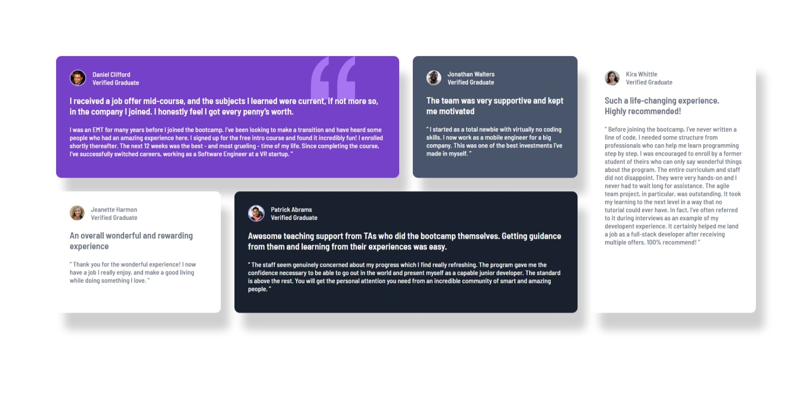

# Frontend Mentor - Testimonials grid section solution

This is a solution to the [Testimonials grid section challenge on Frontend Mentor](https://www.frontendmentor.io/challenges/testimonials-grid-section-Nnw6J7Un7). Frontend Mentor challenges help you improve your coding skills by building realistic projects. 

## Table of contents

- [Overview](#overview)
  - [Screenshot](#screenshot)
  - [Links](#links)
- [My process](#my-process)
  - [Built with](#built-with)
  - [What I learned](#what-i-learned)
  - [Continued development](#continued-development)
  - [AI Collaboration](#ai-collaboration)
- [Author](#author)
- [Acknowledgments](#acknowledgments)

**Note: Delete this note and update the table of contents based on what sections you keep.**

## Overview


### Screenshot



### Links

- Solution URL: [Frontend Mentor Solution](https://www.frontendmentor.io/solutions/testimonials-grid-section-using-grid-fzj5-JZ_Aj)
- Live Site URL: [Website](https://osmond20.github.io/Testimonials-Grid-Section/)

## My process

### Built with

- Semantic HTML5 markup
- CSS custom properties
- Flexbox
- CSS Grid
- Mobile-first workflow
- SASS

### What I learned

I learned how to integrate a image into the background of a card, which I found to be cool.
code snippets, below:

```css
background-image: url(images/bg-pattern-quotation.svg);
background-repeat: no-repeat;
background-position-x: 600px;
background-blend-mode: lighten;
background-size:auto;
```

### Continued development

Will be getting better at using grid, very useful for mobile-first design and helps with not having to use flexbox for the mobile-first design as by using grid-template-column initially, the elements in a mobile-first approach can stack vertically naturally.

### AI Collaboration

- What tools did you use (e.g., ChatGPT, Claude, GitHub Copilot)? Copliot
- How did you use them (e.g., debugging, generating boilerplate, brainstorming solutions)? Used for debugging.
- What worked well? Really helped in spotting my issues and providing me hints to solve and also showing me the better usability that comes with using Grid.

## Author

- Website - [Github](https://github.com/osmond20)
- Frontend Mentor - [@osmond20](https://www.frontendmentor.io/profile/yourusername)
- Twitter - [@yourusername](https://www.twitter.com/yourusername)

**Note: Delete this note and add/remove/edit lines above based on what links you'd like to share.**

## Acknowledgments

This is where you can give a hat tip to anyone who helped you out on this project. Perhaps you worked in a team or got some inspiration from someone else's solution. This is the perfect place to give them some credit.

**Note: Delete this note and edit this section's content as necessary. If you completed this challenge by yourself, feel free to delete this section entirely.**
